 

# 📸 Captures d'écran

Un tour rapide de l'aspect de la carte selon les configurations. Retour au [README principal](../README.fr.md).

> ℹ️ Ces images sont celles que les tests de régression visuelle du projet comparent (`visual/baseline/`) : elles correspondent donc toujours au code actuel et sont redessinées avec `npm run visual:update` à chaque changement du dessin. Chacune est un instant figé de l'aquarium (même graine aléatoire, même horloge). Elles montrent uniquement le dessin de l'aquarium : les tuiles sous l'aquarium en mode normal sont de simples éléments de Home Assistant et ne sont pas sur les images. Les textes des images sont en anglais.

## Biotopes et styles

Les trois biotopes (`theme`) dans les trois styles des êtres vivants (`creature_style`), avec 12 L consommés à 34 °C. De gauche à droite : `flat` (par défaut), `cartoon` et `realistic`. Voir les [styles](../README.fr.md#-styles-des-êtres-vivants) et les poissons de chaque biotope dans le README principal.

<table>
<tr>
<td align="center" width="33%"> **Eau douce** (`theme: freshwater`), plat. Ancistrus, discus, scalaires, néons et une plante.</td>
<td align="center" width="33%"> **Eau douce**, `creature_style: cartoon` : contours, gros yeux brillants.</td>
<td align="center" width="33%">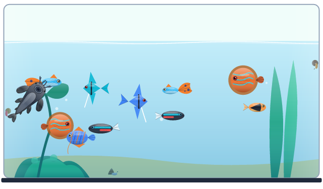 **Eau douce**, `creature_style: realistic` : ombrages doux, écailles, nageoires translucides.</td>
</tr>
<tr>
<td align="center" width="33%">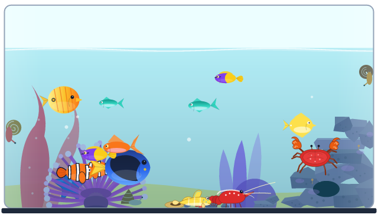 **Eau de mer** (`theme: saltwater`), plat. Poissons-clowns, chirurgien bleu, un crabe sur son tas de pierres vivantes, une crevette, un gobi.</td>
<td align="center" width="33%">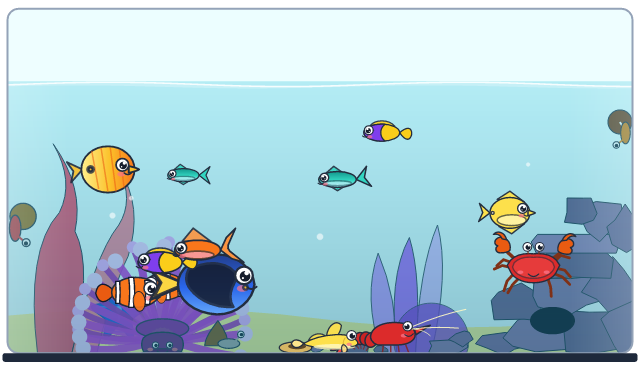 **Eau de mer**, `creature_style: cartoon`.</td>
<td align="center" width="33%">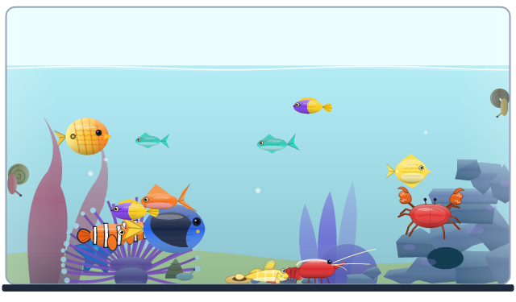 **Eau de mer**, `creature_style: realistic`.</td>
</tr>
<tr>
<td align="center" width="33%">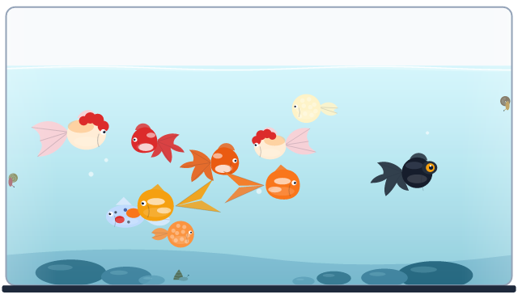 **Eau froide** (`theme: coldwater`), plat. Six sortes de poissons rouges.</td>
<td align="center" width="33%">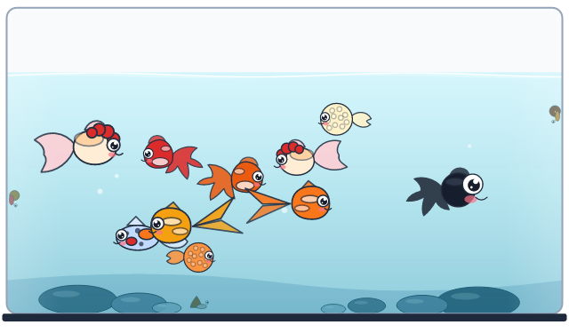 **Eau froide**, `creature_style: cartoon`.</td>
<td align="center" width="33%">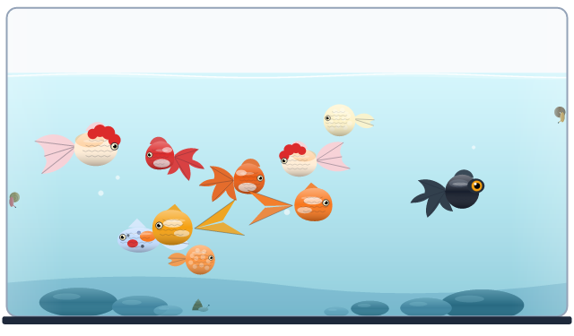 **Eau froide**, `creature_style: realistic`.</td>
</tr>
</table>

## États de l'aquarium

L'eau baisse avec le volume consommé, rougit quand elle est trop chaude, et les animaux ne survivent ni à un bac vide ni à une eau bouillante. Le budget par défaut est de 50 L, avec 5 L de réserve de survie.

<table>
<tr>
<td align="center" width="50%">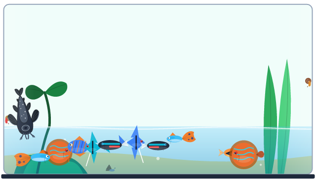 **Avertissement** : 40 L consommés sur un budget de 50 L. Au-delà de 70 % du budget, l'eau est basse et devient d'un bleu plus profond.</td>
<td align="center" width="50%">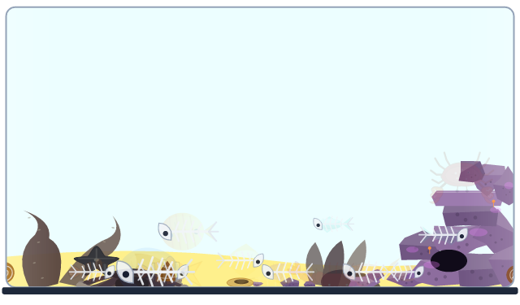 **Budget dépassé** : 55 L, le budget (50 L) et la réserve de survie (5 L) sont épuisés. Le bac est vide.</td>
</tr>
<tr>
<td align="center" width="50%">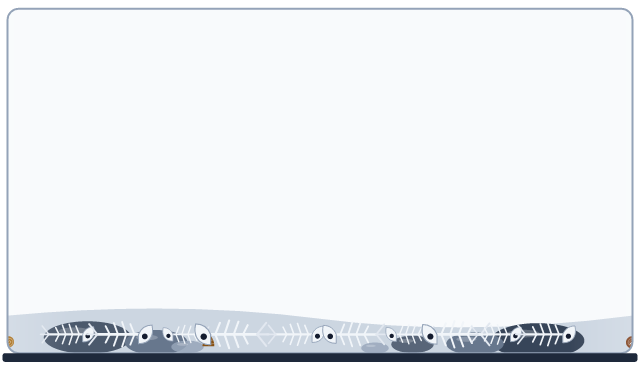 **Vidé** : 60 L, plus que le budget et la réserve réunis. Il ne reste que les squelettes.</td>
<td align="center" width="50%">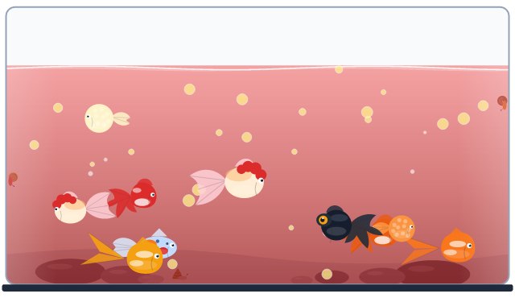 **Ébullition** : eau à 42 °C (`temp_boiling_threshold: 40`). L'eau rougit, des bulles montent et les poissons sont stressés.</td>
</tr>
<tr>
<td align="center" width="50%">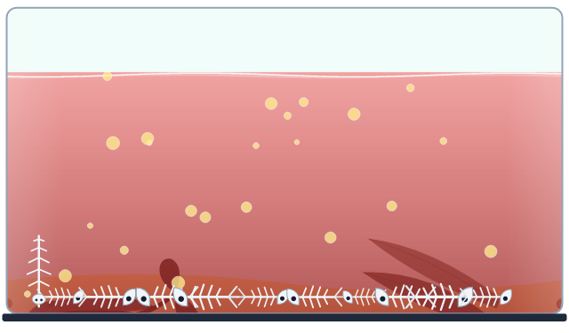 **Mort de chaleur** : 50 °C dépasse `temp_deadly_threshold` (45 °C). Les plantes se couchent, les poissons coulent.</td>
<td align="center" width="50%">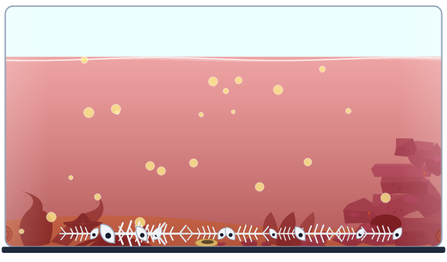 **Mort de chaleur** dans le récif : les coraux rétrécissent et s'effondrent, l'anémone retombe, molle.</td>
</tr>
<tr>
<td align="center" width="50%">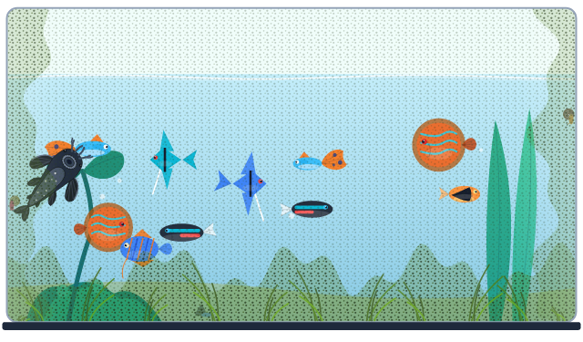 **Algues** : `algae_age: 40`. Le voile monte sur la vitre et des touffes poussent sur le sol.</td>
<td align="center" width="50%">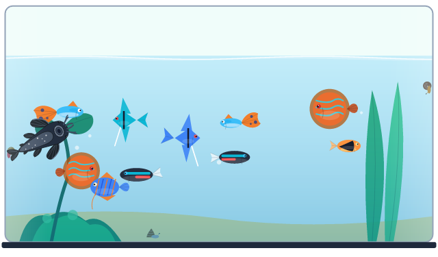 **Dix poissons** (`fish_count: 10`) : ils gardent leurs distances et ne s'entassent pas.</td>
</tr>
</table>

## Interactions en direct

Ce qui se passe quand on utilise la carte : l'eau qui coule, une pincée de nourriture, un coup sur la vitre. Voir [Interactions](../README.fr.md#-interactions-et-animations-en-direct).

<table>
<tr>
<td align="center" width="33%">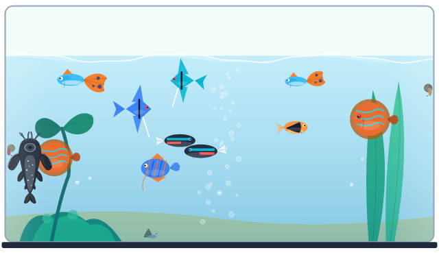 **Eau qui coule** : tant que le volume augmente, la surface s'agite et des bulles montent du fond.</td>
<td align="center" width="33%">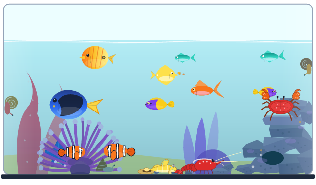 **Nourriture** : un toucher près de la surface jette une pincée de flocons, et les poissons se précipitent.</td>
<td align="center" width="33%">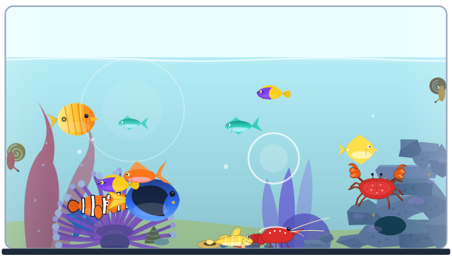 **Coup sur la vitre** : ondes de choc, les poissons s'écartent, le crabe court vers une grotte et le gobi s'enfonce dans le sable.</td>
</tr>
</table>

## Capteur indisponible

Quand le capteur de volume n'a plus de valeur utilisable depuis une minute, le dernier volume reste affiché avec un avis. Voir [Capteur indisponible](../README.fr.md#-capteur-indisponible).

<table>
<tr>
<td align="center" width="50%">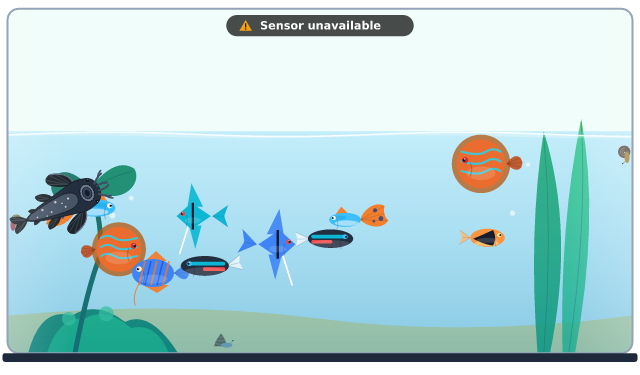 **Mode normal** : l'avis en haut de l'image.</td>
<td align="center" width="50%">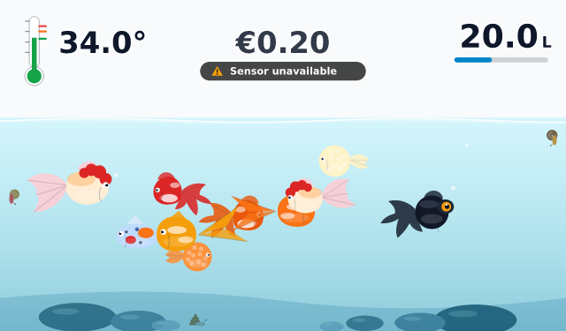 **Plein écran** : l'avis sous les jauges et le coût.</td>
</tr>
</table>

## Jauges et coût

Les jauges du plein écran (`fullscreen: true`), dans les deux styles (`gauge_style`). Voir [Jauges du plein écran](../README.fr.md).

<table>
<tr>
<td align="center" width="50%">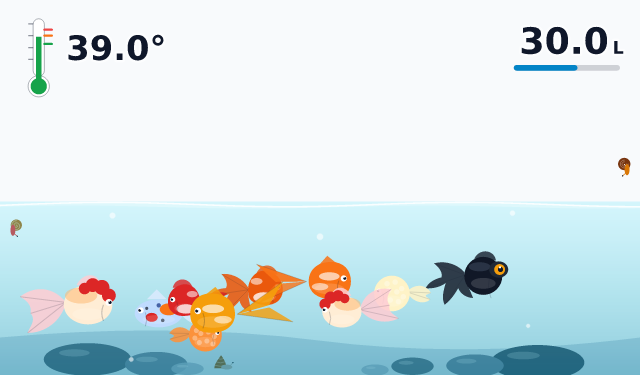 **Thermomètre et barre** (`gauge_style: thermometer`, par défaut) : 30 L à 39 °C.</td>
<td align="center" width="50%">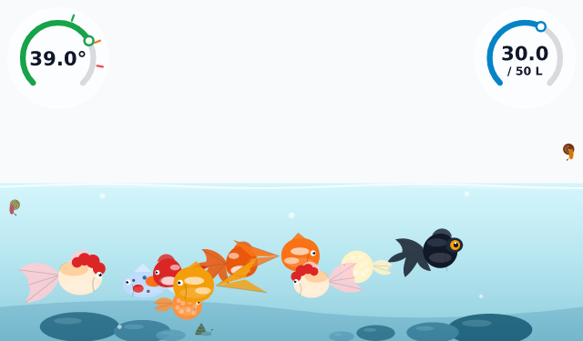 **Arcs ouverts** (`gauge_style: arc`) avec le budget écrit sur la jauge de volume (`show_budget: true`).</td>
</tr>
<tr>
<td align="center" width="50%">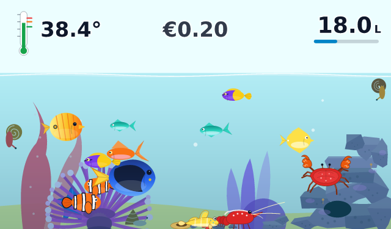 **Coût** (`show_cost: true`) entre les deux jauges.</td>
<td align="center" width="50%">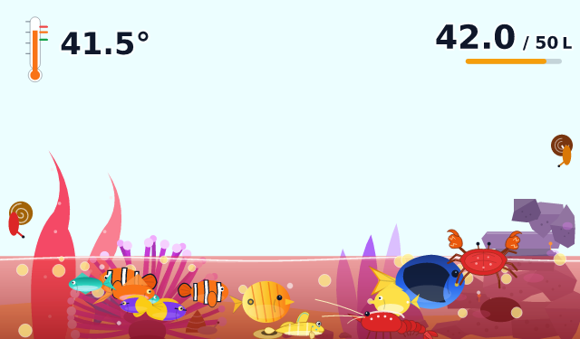 **Budget** (`show_budget: true`) : 42 L sur 50 L à 41,5 °C. La barre est ambre au-delà de 70 % et l'eau est chaude.</td>
</tr>
<tr>
<td align="center" width="50%">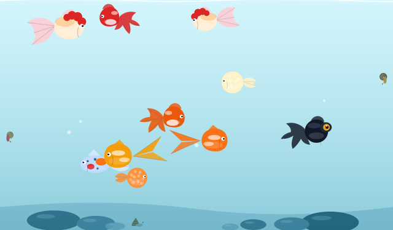 **Rien de consommé** : les jauges restent masquées à 0 L sur un tableau de bord (l'aperçu de l'éditeur les montre pour pouvoir les régler).</td>
<td align="center" width="50%">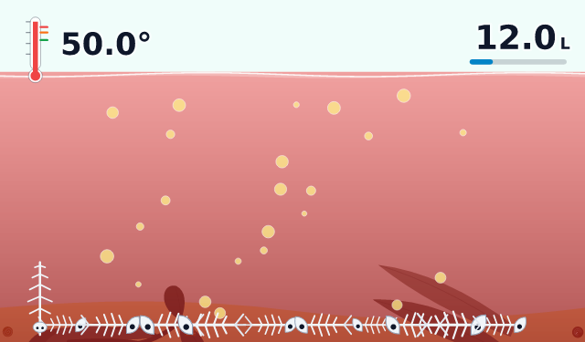 **Plein écran, mort de chaleur** : les jauges restent, en rouge.</td>
</tr>
<tr>
<td align="center" width="50%">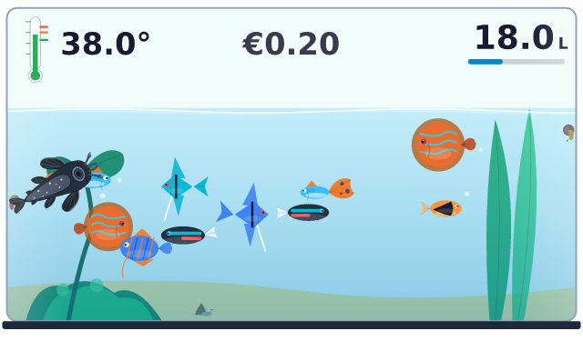 **Jauges hors plein écran** (`show_gauges: true`) avec les tuiles supprimées (`show_tiles: false`) : le coût s'écrit entre les jauges.</td>
<td></td>
</tr>
</table>

## Plein écran sur toutes les formes d'écran

En plein écran, le dessin prend exactement la forme de l'écran : rien n'est étiré. Voir `fullscreen` dans le README principal.

<table>
<tr>
<td align="center" width="50%">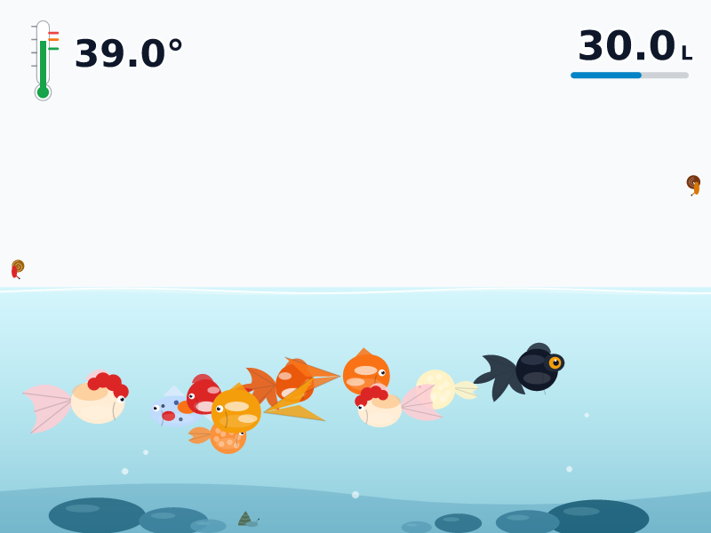 **Tablette 4:3** (800 × 600).</td>
<td align="center" width="50%">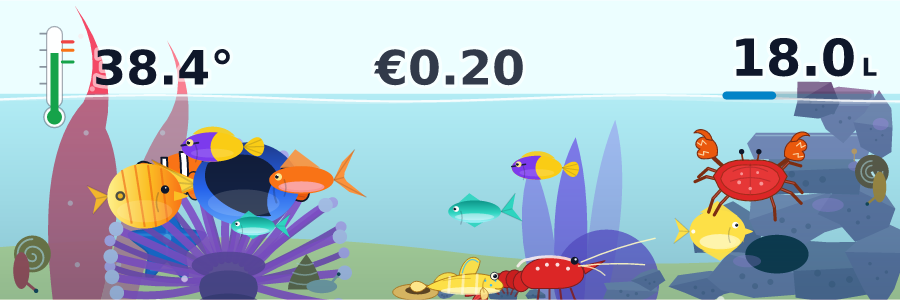 **Ultra-large** (3:1) : un aquarium plat.</td>
</tr>
<tr>
<td align="center" width="50%">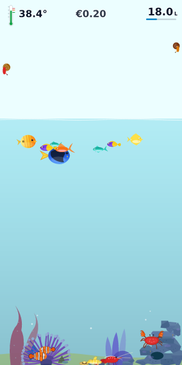 **Portrait** (1:2) : un aquarium haut, le tas de pierres monte avec le fond.</td>
<td align="center" width="50%">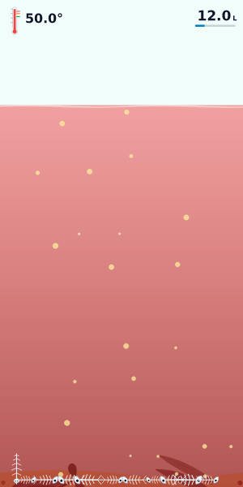 **Portrait, mort de chaleur**.</td>
</tr>
</table>

## Performance

Le profil d'animation léger est prévu pour les écrans peu puissants comme le Google Nest Hub : 20 images par seconde, effets simplifiés. Voir [Qualité d'animation](../README.fr.md).

<table>
<tr>
<td align="center" width="50%">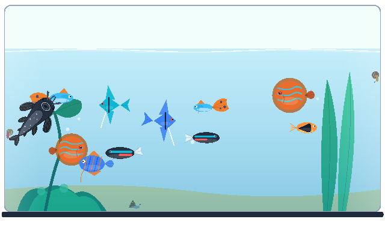 **Léger** (`animation_quality: light`) : le dessin est le même, les effets sont plus simples.</td>
<td></td>
</tr>
</table>

## Contribuer

Tu as une capture de la carte dans ton propre tableau de bord ? Ouvre une PR ou une issue avec l'image et les options utilisées pour l'obtenir, et elle pourra être ajoutée ici (à mettre dans `docs/screenshots/`). Les images de cette page ne se modifient pas à la main : elles sont produites par `npm run visual:update`.
